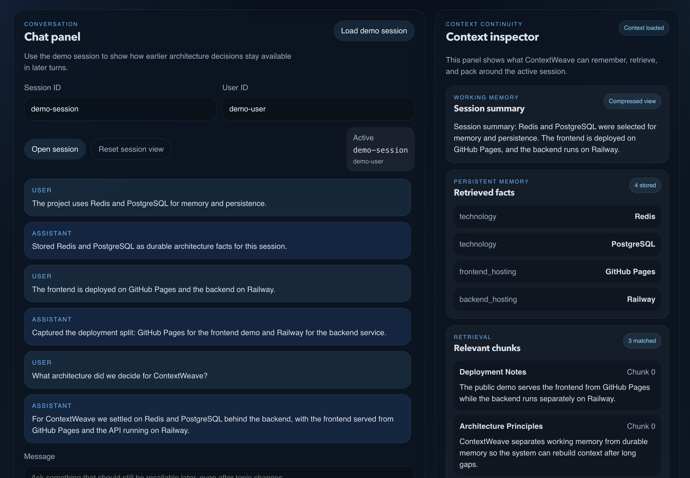
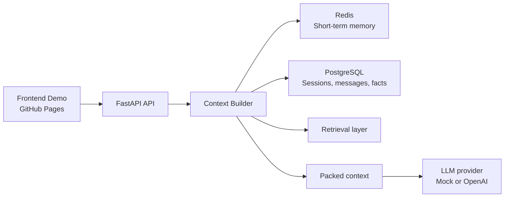

# ContextWeave

<p align="center">
  
</p>

<p align="center"><strong>Context continuity beyond the prompt.</strong></p>

<p align="center">
  <a href="https://github.com/theeseg/context-weave/actions/workflows/ci.yml">
    
  </a>
  
  
  
  <a href="LICENSE">
    
  </a>
  <a href="https://github.com/theeseg/context-weave/stargazers">
    
  </a>
</p>

ContextWeave is an open-source memory and context infrastructure project for AI applications. It reconstructs conversational context from working memory, persistent facts, retrieval results, and summaries before every model call, so continuity survives long and multi-session conversations without letting prompts grow indefinitely.

## Live Demo

- Frontend demo: **[ContextWeave Demo](https://theeseg.github.io/context-weave/)**
- Backend API docs: available on any running backend at `/docs`, or locally at [http://localhost:8000/docs](http://localhost:8000/docs)

GitHub Pages hosts the static frontend. The backend can run separately and is configured through `VITE_API_BASE_URL`. If no public backend is available, the frontend can still run in browser-only fallback mode with `VITE_DEMO_MODE=true`.

## Demo Preview

<p align="center">
  
</p>

<p align="center"><em>ContextWeave demo interface with Context Inspector</em></p>

## Why This Project Exists

Many AI applications still treat context as whatever fits inside the current prompt. That is acceptable for short demos, but it breaks when conversations span multiple topics, sessions, or time horizons. ContextWeave shows a pragmatic alternative: keep short-term memory explicit, make durable memory inspectable, and rebuild the right context for every turn.

## How ContextWeave Works

ContextWeave reconstructs conversational context before every model call. Instead of sending only the latest message, it composes a structured context pack from multiple layers:

- recent conversation turns from working memory
- persistent facts stored across turns
- retrieved reference context
- a compact conversation summary

The result is a bounded, explainable context pipeline designed to preserve continuity without letting prompts expand indefinitely.

## Example

1. A user says: "We decided to use FastAPI for the API layer."
2. Several turns later, the user asks: "What framework did we choose?"
3. ContextWeave rebuilds context from recent turns, stored facts, and summary state.
4. The assistant can answer consistently because the framework choice remains available even when the earlier message is no longer in the prompt window.

## Architecture



## Architecture Overview

### Backend

- `POST /chat` loads or creates the session, reconstructs context, generates a response, persists messages, updates memory, and stores newly extracted facts
- Redis holds recent messages, summaries, and task state for short-term continuity
- PostgreSQL stores sessions, messages, persistent facts, documents, and chunks
- the retrieval abstraction keeps the MVP simple while leaving a clean path toward stronger semantic ranking

### Frontend

- the React + Vite demo keeps the chat experience readable while exposing the memory system through the Context Inspector
- the Context Inspector shows summary, facts, chunks, debug metadata, and the final packed context sent to the provider
- Memory ON/OFF mode makes the value of layered context visible during the same session

### Deployment

- GitHub Pages hosts the public frontend demo
- Railway hosts the backend API
- Docker Compose supports local PostgreSQL and Redis for development

More detail:

- [`docs/architecture.md`](/Users/ivanesegovic/Documents/Codex/context-weave/docs/architecture.md)
- [`docs/data-model.md`](/Users/ivanesegovic/Documents/Codex/context-weave/docs/data-model.md)
- [`docs/evolution.md`](/Users/ivanesegovic/Documents/Codex/context-weave/docs/evolution.md)
- [`docs/frontend.md`](/Users/ivanesegovic/Documents/Codex/context-weave/docs/frontend.md)
- [`docs/frontend-demo.md`](/Users/ivanesegovic/Documents/Codex/context-weave/docs/frontend-demo.md)

## Features

- public frontend demo with chat panel and Context Inspector
- Context Debugger for the final packed context sent to the provider
- Memory ON/OFF comparison mode
- Redis short-term memory for recent turns, summaries, and task state
- PostgreSQL-backed persistent facts, messages, documents, and chunks
- retrieval abstraction ready for stronger semantic search later
- heuristic fact extraction and deterministic summarization
- backend tests, Playwright tests, and GitHub Actions CI
- Docker Compose local setup for quick development

## Tech Stack

### Backend

- Python 3.12
- FastAPI
- SQLAlchemy
- Alembic
- Pydantic
- pytest

### Frontend

- React
- Vite
- TypeScript
- Playwright

### Infrastructure

- PostgreSQL
- Redis
- pgvector-ready schema
- Docker Compose
- GitHub Pages
- Railway

## When to Use ContextWeave

ContextWeave is useful for applications where conversational state needs to survive beyond a single prompt window:

- AI copilots
- chat assistants
- multi-step AI workflows
- agent systems
- applications that need durable context continuity across turns or sessions

## Quick Start

### Option A: Local Python 3.12

```bash
cp .env.example .env
python3.12 -m venv .venv
source .venv/bin/activate
pip install -e ".[dev]"
make up
make seed
make ingest
make run
```

### Option B: Docker-only

This path works even if `python3.12` is not installed on your machine.

```bash
cp .env.example .env
make up
make seed-docker
make ingest-docker
make run-docker
```

The API will be available at [http://localhost:8000](http://localhost:8000).

### Frontend Demo

```bash
cp frontend/.env.example frontend/.env
make frontend-install
make frontend-dev
```

The frontend runs on `http://localhost:5173` and connects to the backend through `VITE_API_BASE_URL`. Set `VITE_DEMO_MODE=true` to force browser-only fallback mode.

## Main Endpoints

- `GET /health`
- `POST /chat`
- `GET /sessions/{session_id}/context`

Example:

```bash
curl -X POST http://localhost:8000/chat \
  -H "Content-Type: application/json" \
  -d '{
    "session_id": "demo-session",
    "user_id": "demo-user",
    "message": "We chose FastAPI, Redis, and PostgreSQL."
  }'
```

## Testing and CI

ContextWeave is validated through backend tests, Playwright end-to-end tests for the demo UI, and GitHub Actions CI on pushes to `main` and on pull requests.

Backend:

```bash
make test
```

Docker:

```bash
make test-docker
```

Frontend build and E2E:

```bash
make frontend-build
cd frontend && npm run test:e2e
```

## Roadmap

Near-term work is focused on making the memory engine more transparent and more useful in real AI applications:

- context scoring and better memory selection
- improved fact extraction and persistence quality
- context timeline and replay tooling
- broader provider integrations

See [`docs/roadmap.md`](/Users/ivanesegovic/Documents/Codex/context-weave/docs/roadmap.md).

## Contributing

Contributions are welcome. Small focused pull requests, bug reports, demo polish, and architecture discussions are all useful. If you plan a larger change, opening an issue first is the easiest way for us to align on scope.

## Positioning

ContextWeave is a pragmatic reference implementation for AI context memory.

It is built to show how to combine working memory, persistent facts, retrieval, and context packing in a way that is easy to understand, test, and evolve.

It is not a generic AI orchestration framework or a full agent platform.

Its main differentiators are:

- simple architecture
- local-first developer experience
- explicit testing strategy
- clear evolution path from MVP to enterprise

See [`docs/positioning.md`](/Users/ivanesegovic/Documents/Codex/context-weave/docs/positioning.md).

## License

MIT. See [`LICENSE`](/Users/ivanesegovic/Documents/Codex/context-weave/LICENSE).
