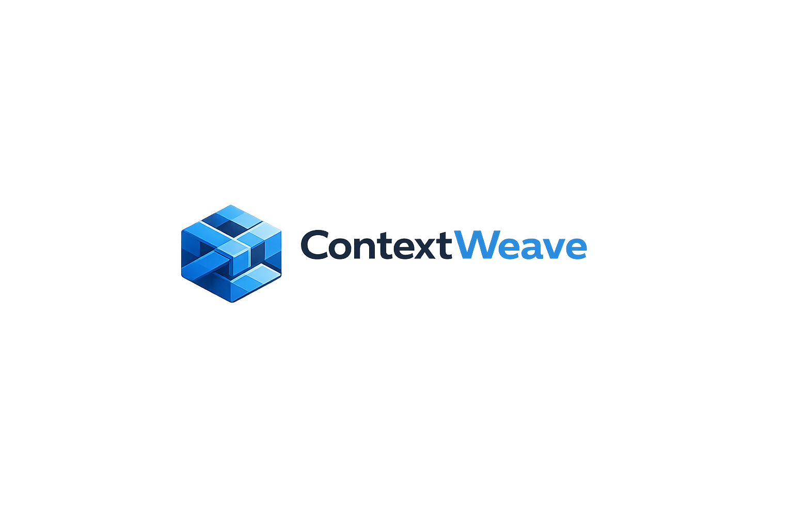

# ContextWeave

<p align="center">
  
</p>

<p align="center"><strong>Context continuity beyond the prompt.</strong></p>

ContextWeave is a pragmatic layered memory architecture for AI applications. It combines short-term memory, persistent facts, retrieval, and context packing to preserve continuity across long and multi-session conversations without depending only on the prompt window.

## Live Demo

Try the public demo here:

**[ContextWeave Demo](https://theeseg.github.io/context-weave/)**

GitHub Pages hosts only the static frontend. The backend remains separate and is configured through `VITE_API_BASE_URL`.
The current public setup serves the frontend from GitHub Pages and the backend from Railway.

If no public backend is available, the Pages build can run with `VITE_DEMO_MODE=true`, which enables a browser-only fallback flow that still demonstrates conversation continuity, summary updates, extracted facts, and retrieved chunks.

## Why This Project Exists

Many AI applications still treat context as whatever fits inside the current prompt. That works for short demos, but it breaks down when conversations span multiple topics, sessions, or time horizons. ContextWeave exists to show a practical alternative: keep working memory explicit, make durable memory inspectable, and build each response from a grounded context pack.

## Problem

Prompt windows alone are not enough for durable conversational continuity. Real applications need:

- recent working memory for active turns
- durable message and fact storage
- retrieval over reference documents
- a deterministic way to pack the right context for each response

## Solution

ContextWeave uses:

- Redis for recent messages, summaries, and task state
- PostgreSQL for sessions, messages, facts, documents, and chunks
- a retrieval abstraction that is ready for stronger semantic search later
- a context builder that assembles grounded memory before response generation
- a mock LLM provider for local demos and an optional OpenAI-backed provider

## Architecture Overview

`POST /chat` validates the request, loads or creates the session, builds a context pack from Redis and PostgreSQL, generates a grounded response, persists both messages, refreshes short-term memory, updates the summary, and stores newly extracted facts.

The browser demo adds a lightweight frontend layer on top of that flow. A chat panel drives the conversation, while a context inspector shows the summary, extracted facts, retrieved chunks, and runtime metadata that make each response context-aware.

More detail:

- [`docs/architecture.md`](/Users/ivanesegovic/Documents/Codex/context-weave/docs/architecture.md)
- [`docs/data-model.md`](/Users/ivanesegovic/Documents/Codex/context-weave/docs/data-model.md)
- [`docs/evolution.md`](/Users/ivanesegovic/Documents/Codex/context-weave/docs/evolution.md)
- [`docs/frontend.md`](/Users/ivanesegovic/Documents/Codex/context-weave/docs/frontend.md)
- [`docs/frontend-demo.md`](/Users/ivanesegovic/Documents/Codex/context-weave/docs/frontend-demo.md)

## MVP Scope

- FastAPI app with `GET /health` and `POST /chat`
- React + Vite frontend demo with a context inspector
- PostgreSQL persistence for sessions, messages, facts, documents, and chunks
- Redis working memory
- sample document ingestion from [`examples/sample_documents`](/Users/ivanesegovic/Documents/Codex/context-weave/examples/sample_documents)
- retrieval abstraction with simple keyword ranking
- deterministic summarization and heuristic fact extraction
- tests for unit, integration, and continuity scenarios
- Docker Compose for local startup

## Tech Stack

- Python 3.12
- FastAPI
- Redis
- PostgreSQL
- pgvector-ready schema
- SQLAlchemy
- Alembic
- Pydantic
- Docker Compose
- pytest

## Quick Start

### Option A: Local Python 3.12

```bash
cp .env.example .env
python3.12 -m venv .venv
source .venv/bin/activate
pip install -e ".[dev]"
make up
make seed
make ingest
make run
```

### Option B: Docker-only

This path works even if `python3.12` is not installed on your machine.

```bash
cp .env.example .env
make up
make seed-docker
make ingest-docker
make run-docker
```

The API will be available at [http://localhost:8000](http://localhost:8000).

### Frontend Demo

```bash
cp frontend/.env.example frontend/.env
make frontend-install
make frontend-dev
```

The frontend runs on `http://localhost:5173` and connects to the backend through `VITE_API_BASE_URL`. Set `VITE_DEMO_MODE=true` to force browser-only fallback mode. The context inspector is the key demo feature: it shows the current summary, extracted facts, retrieved chunks, and debug metadata behind the conversation.

For GitHub Pages, the frontend is built with the `/context-weave/` base path and deployed independently from the backend.
The demo is optimized for both desktop and mobile viewing, with the chat flow prioritized on smaller screens.

## Main Endpoints

- `GET /health`
- `POST /chat`
- `GET /sessions/{session_id}/context`

Example:

```bash
curl -X POST http://localhost:8000/chat \
  -H "Content-Type: application/json" \
  -d '{
    "session_id": "demo-session",
    "user_id": "demo-user",
    "message": "We chose FastAPI, Redis, and PostgreSQL."
  }'
```

## Testing

Local Python 3.12:

```bash
make test
```

Docker:

```bash
make test-docker
```

Frontend build check:

```bash
make frontend-build
```

GitHub Pages deploy:

- push to `main`
- the workflow in [`.github/workflows/deploy-pages.yml`](/Users/ivanesegovic/Documents/Codex/context-weave/.github/workflows/deploy-pages.yml) builds `frontend/` and publishes `frontend/dist`
- configure repository variables `VITE_API_BASE_URL` and `VITE_DEMO_MODE` if you want to point the public demo at a live backend or force mock mode

## Roadmap

- Phase 1: MVP foundations
- Phase 2: stronger retrieval, background workers, ingestion APIs, CI/CD, and evaluation
- Phase 3: service decomposition, Kafka-backed events, multi-tenant support, and observability

See [`docs/roadmap.md`](/Users/ivanesegovic/Documents/Codex/context-weave/docs/roadmap.md).

## Positioning

ContextWeave is a pragmatic reference implementation for AI context memory.

It is built to show how to combine working memory, persistent facts, retrieval, and context packing in a way that is easy to understand, test, and evolve.

It is not a generic AI orchestration framework or a full agent platform.

Its main differentiators are:

- simple architecture
- local-first developer experience
- explicit testing strategy
- clear evolution path from MVP to enterprise

See [`docs/positioning.md`](/Users/ivanesegovic/Documents/Codex/context-weave/docs/positioning.md).

## License

MIT. See [`LICENSE`](/Users/ivanesegovic/Documents/Codex/context-weave/LICENSE).
